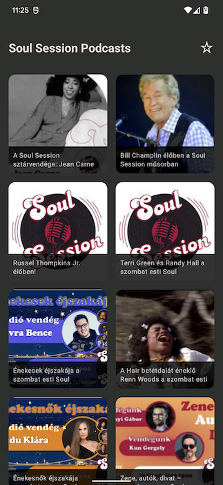
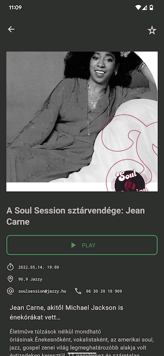
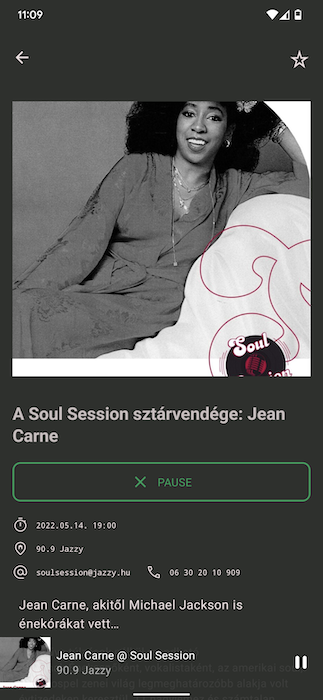
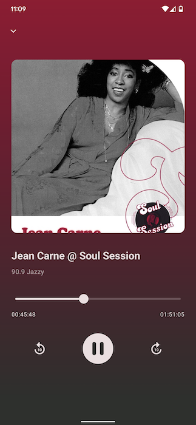

Soul Session
==================
A demo app using compose and Hilt based on modern Android tech-stacks and MVVM architecture.  Fetching data from the network and integrating persisted data in the database via repository pattern.
Podcast playback with ExoPlayer.

## Development

 * Entirely written in [Kotlin](https://kotlinlang.org/).
 * UI written in [Jetpack Compose](https://developer.android.com/jetpack/compose) 
 * Uses [Kotlin Coroutines](https://kotlinlang.org/docs/reference/coroutines/coroutines-guide.html)
 * Uses many of the [Architecture Components](https://developer.android.com/topic/libraries/architecture/), such as: Room, Lifecycle, Navigation.
 * Uses [Hilt](https://dagger.dev/hilt/) for dependency injection
 * Fully modularized
 * Podcast metadata retrieve from network
 * Background playback with foreground service
 * Offline playback support with ExoPlayer's `CacheDataSource`
 
 ### Code style

This project uses [ktlint](https://github.com/pinterest/ktlint), provided via
the [spotless](https://github.com/diffplug/spotless) gradle plugin, and the bundled project IntelliJ codestyle

## Screenshots

## Contents Credits
All copyrights of the contents, concepts, and phrases used for this open-source project belong to [Jazzy Radio](https://www.jazzy.hu/).

## License

Soul Session is distributed under the terms of the Apache License (version 2.0). See the
[license](LICENSE) for more information.